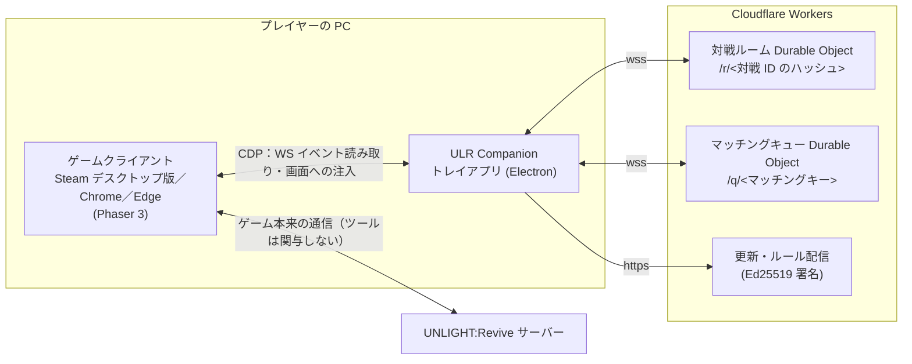

# ULR Companion

[繁體中文](README.md) ｜ **日本語**

[](https://github.com/UnlightPlugin/ulr-companion/actions/workflows/ci.yml)
[](https://github.com/UnlightPlugin/ulr-companion/releases/latest)
[](LICENSE)

UNLIGHT:Revive のプレイヤーコミュニティ向け補助ツールです。**独自 COST ルール**、
**ゲーム内クイックマッチ（自動マッチング）**、**対戦補助**を提供します。

Windows のタスクトレイに常駐し、Chrome DevTools Protocol（CDP）で起動中のゲームクライアント
（Steam デスクトップ版・Chrome・Edge）に接続して、機能をゲーム画面そのものに描き込みます。
ゲームファイルは改変せず、パケットの偽造もしません —— ゲームサーバーへ送られるのは、
すべてゲームクライアントが本来送るイベントです。

> 本プロジェクトはプレイヤーコミュニティによる非公式ツールであり、ゲームの開発・運営元とは関係ありません。

> **言語について**：トレイアプリの画面と `docs/` 以下の詳細ドキュメントは、現在繁体字中国語のみです。
> 本文中の「」内の UI 名は、実際の画面表記（中国語）をそのまま載せています。

---

## 機能

### 独自 COST ルール

- キャラクター・モンスター・装備カード・イベントカードの **4 つの表**をすべて編集でき、コスト差ペナルティ（圧縮ペナルティ）も任意の区間で定義できます
- トレイに編集画面を内蔵。クライアントから書き出した公式 COST 表をそのまま fork できます
- ゲーム内の COST 表示とコスト差ペナルティを、選んだルールで再計算して表示します
- インストール直後から既定のルールが適用され、自動で更新されます（Ed25519 の署名検証に通ったものだけを受け入れます）

### ディートヘルムの「クイックマッチ」

- ディートヘルムのロビーに、アレクサンドルと同じ見た目・同じ操作の「クイックマッチ」ボタンを追加します。INFO 欄には区分ごとの待機人数を表示します
- **COST 区分はその時点のデッキから自動で計算**するので、入力は不要です。公式の区分から外れるデッキは、そのデッキ自身の区分で待機します
- 相手が見つかると自動で部屋を作成／入室します。同じルールの**別バージョン同士でもマッチング可能**です —— 両者が「この一戦」の計算結果の指紋を交換し、一致した場合のみ対戦が始まります
- 対戦ステージ：アレクサンドル方式のランダム、公式ランダム、またはステージ指定（公式メニューでは選べない `010`〜`013` を含む）

### 対戦補助（双方が導入している場合のみ有効）

- **準備**：双方が OK を押して初めて送信されるため、先に押した側が不利になりません。押した後にもう一度押せば取り消せます
- **秒数上限**：双方が移動フェイズの長さを設定し、**長いほう**を共通の値として使います

### デッキライブラリ（main に統合済み・未リリース）

- サーバーに保存できるデッキは 3 つだけですが、ローカルに**無制限**に保存でき、ゲームのデッキ編集画面からそのまま切り替え・追加・削除できます
- 部屋の種類（クエスト・渦・アレクサンドル・ディートヘルム）ごとにデッキを指定でき、対戦開始ボタンを押した瞬間にそのデッキを適用してから開始します

### その他

- **隠しステージ**：公式の部屋作成メニューで選べない `010`〜`013` をメニューに戻します
- **多重起動**：1 ウィンドウで 1 クライアントを管理。デスクトップ版・Chrome・Edge で別々のアカウントを同時に扱えます
- **自動更新**：1 時間ごとに確認し、ダウンロードした更新を対戦中に適用することはありません

---

## インストール（プレイヤー向け）

1. [Releases](https://github.com/UnlightPlugin/ulr-companion/releases/latest) から **zip** をダウンロードしてください
   （exe は避けてください —— 署名のない exe はブラウザに危険と判定され、ブロックされることがあります）。

   > 展開する**前に**、zip を右クリック →「プロパティ」→「許可する」にチェック → OK。
   > 展開したファイルに Mark-of-the-Web が付かなくなり、SmartScreen の警告が出ません。

   展開先はユーザーフォルダ配下にしてください。**`C:\Program Files\` は不可**です（書き込めないため自動更新に失敗します）。

2. **Steam で debug port を一度だけ設定してください。** 設定しないとトレイは接続できません
   （画面に「等遊戲…」と表示されたままになります）。手順はトレイの「設置 › 連線」に書いてあります。

3. ゲームを起動すると自動で接続します。既定のルールは適用済みです。自分のルールに切り替える、
   あるいは完全にオフにするには「牌組 › Cost 表」から操作します。オフにすると自動マッチングも使えません
   —— ルールがなければ「取り決め」も成り立たないためです。

事前に知っておいてほしいこと：

- **コード署名はまだありません**（証明書が有償のため未購入）。「許可する」を忘れた場合は、初回起動時に
  「詳細情報 → 実行」を選んでください。ソースコードはすべてここにあり、自分で `npm run dist` すれば同じものが
  できます。Release ページには SHA-256 も載せています。**誰に言われても、システムの保護機能は無効にしないでください。**
- **自動マッチングは部屋の作成・入室を代行します**。つまり AP を消費してそのまま対戦が始まります。
  自分で「クイックマッチ」を押したときにしか動かず、もう一度押せば取り消しです。
- 不具合の報告には、**バージョン番号**（ウィンドウ左上）と「設置 › 記錄」の内容を添えてください。
  ログにはゲームの内容は含まれないので、そのまま貼って大丈夫です。

---

## 公平性とプライバシー

### 設計方針

- サーバー側の判定は変更せず、公式の戦闘ルールも迂回しません
- 勝敗に影響する機能は**すべて双方の同意がある場合のみ有効**です。調整は常に「どちらにとっても厳しくならない側」を取るため、
  相手の思考時間を一方的に短くできる設定は存在しません
- 相手の公開されていない手札や隠し情報は、表示もアップロードもしません
- 独自 COST は**自主的な取り決め**です。双方が合意した対戦でのみ意味を持ち、アレクサンドルや公式環境には一切影響しません

| 機能     | 調整方法 | 相手が見つからない場合       |
| -------- | -------- | ---------------------------- |
| 準備     | and      | 「押し間違いの取り消し」のみ |
| 秒数上限 | max      | 一切短縮しない               |

### 通信先と送信内容

通信はすべて同じサーバー（Cloudflare Workers、ソースは [`apps/link-worker`](apps/link-worker)）宛てです：

| 通信             | タイミング                                     | 送信内容                                       |
| ---------------- | ---------------------------------------------- | ---------------------------------------------- |
| 仲介サーバー     | **対戦中のみ**                                 | ハッシュ化した対戦 ID + 4 つの設定値           |
| マッチングキュー | **ロビーの「クイックマッチ」を押した後**       | ハッシュ化したマッチング条件（下記の例外あり） |
| 待機人数         | ディートヘルムのロビーにいる間、最短 15 秒間隔 | ハッシュ化したマッチングキー                   |
| 更新・ルール確認 | 1 時間ごと                                     | 何も送らず「最新版はどれか」を問い合わせるだけ |

**送信しないもの**：名前、Steam アカウントやトークン、対戦相手が誰か、手札、対戦結果。

対戦 ID は、ゲームの 32 文字の room id の **SHA-256 先頭 64 bit** です。サーバーが答える必要があるのは
「この 2 本の接続は同じ対戦か」だけで、それにはハッシュで十分です —— つまり「サーバーに何が見えるか」は
**信頼の問題ではなく数学の問題**です。対戦外では補助チャネルに一切接続せず、接続できない場合は片側モードに
自動で切り替わります（機能は減りますが、壊れはしません）。

**唯一の例外**：マッチした相手が**別バージョン**のルールを使っている場合、この一戦の結果が一致するかを検算するために、
デッキ記述子（キャラクターコード 3 つ。例：`["cc001_r03", "cc078_04", "cc205_02"]`）を交換します。
これは指紋の計算にのみ使い、表示も記録もせず、参照できる UI もありません。ルールのバージョンが同じなら、
この処理は一切発生しません。詳細は [docs/match-making.md](docs/match-making.md) §7 を参照してください。

サーバーは自前で立てることもできます。`apps/link-worker` は完全なので、設定の「中間人」をそこへ向けるだけです。

---

## アーキテクチャ



TypeScript のモノレポ（npm workspaces）です。各パッケージは `@ulr/xxx` でソースを直接 import するため、
clone 後にビルドは不要です。

| パス                                                 | 内容                                                                                          |
| ---------------------------------------------------- | --------------------------------------------------------------------------------------------- |
| [`packages/rule-schema`](packages/rule-schema)       | ルール形式、JSON Schema 検証、RFC 8785 正規化、内容ハッシュ ← すべての土台                    |
| [`packages/cost-engine`](packages/cost-engine)       | COST 計算（4 つの表＋コスト差ペナルティ）、一戦ごとの意味的な指紋                             |
| [`packages/cdp-adapter`](packages/cdp-adapter)       | ゲームへの接続、WS イベント解析、ゲーム画面への注入（ロビー、デッキ編集、対戦開始ゲートなど） |
| [`packages/arbiter-link`](packages/arbiter-link)     | 仲介サーバーとマッチングキューのプロトコル（純粋関数）とクライアント                          |
| [`packages/arbiter-engine`](packages/arbiter-engine) | 仲裁とマッチングの状態機械、各部品のライフサイクル（CLI とトレイで共用）                      |
| [`packages/deck-library`](packages/deck-library)     | ローカルのデッキライブラリ（純粋なデータ層。ファイルにも CDP にも触れない）                   |
| [`packages/api-contract`](packages/api-contract)     | ルール登録サイト ULGG の API 型定義                                                           |
| [`apps/tray`](apps/tray)                             | トレイアプリ（Electron）                                                                      |
| [`apps/companion`](apps/companion)                   | コマンドラインツール                                                                          |
| [`apps/link-worker`](apps/link-worker)               | サーバー：仲介、マッチングキュー、待機人数、更新・ルール配信                                  |
| [`rules/`](rules)                                    | クライアントから書き出した公式 COST 表とコミュニティのルール                                  |

ルールの公開登録・バージョン管理・戦績統計は [ULGG](https://ulgg.online) が担当し、このリポジトリは実行側です。

---

## 技術的なポイント

**ルールの同一性は内容のハッシュで決まる。** ルールを識別するのは名前でもバージョン番号でもなく、
`Schema 検証 → Canonical JSON（RFC 8785）→ SHA-256` の結果です。「同じ 1.2.0 なのに中身が書き換えられた」
2 つのルールは別物と判定されなければ、一致確認の意味がありません。ルール登録サイトは PHP なので、
言語に依存しないテストベクタも用意しています —— PHP の `json_encode(21.0)` は `21.0` を返しますが、
JCS は `21` を要求します。この 1 点の違いだけで、両者のハッシュはすべて一致しなくなります
（[docs/canonical-json.md](docs/canonical-json.md)）。

**ただし、マッチングの判定基準はルールのハッシュではない。** 2 つのルールの違いが、双方とも使っていないキャラクターの
価格だけなら、この一戦の結果はまったく同じです。それでもハッシュで判定すれば 2 人は永遠にマッチしません ——
ルール作者がバージョンを上げるたびにコミュニティが二分されてしまいます。そこで同じ正規化を 2 回使います。
1 回目はルール全体に（バージョン識別）、2 回目は**この一戦**の計算結果に（`evaluationHash`）。
双方がそれぞれ自分のルールで両者のデッキを計算し、4 つの指紋がすべて一致した場合のみ対戦を始めます
（[docs/match-making.md](docs/match-making.md)）。

**障害時は安全側に倒す。** ゲームに触れる注入にはすべて退路があり、その方向は「元の状態に戻る」です。
準備機能はハートビートで監視し、ツールが落ちた場合はそのフェイズを最後まで維持してから解除します
（プレイヤーの操作途中で挙動を変えないため）。対戦開始ゲートには 8 秒のウォッチドッグがあり、
Node 側が応答しなければそのまま通します —— 古いデッキで始まるほうが、画面で固まるよりずっとましだからです。
有効化はいつでも即時、無効化はフェイズの境目でのみ。無効化には害があり、有効化にはないためです
（[docs/tray.md](docs/tray.md)）。

**注入した画面は、ゲームそのものに見える。** ロビーのボタンやデッキ編集のメニューは、ゲーム自身のテクスチャ・
フォント・UI プラグイン（rexUI）を使って Phaser のシーン上に描画しています。注入ページ側のペナルティ計算と
Node 側の Cost Engine は別々の実装なので、テストで総当たり比較して一致を保証しています。リポジトリには
**ゲームの画像を一切含みません**。トレイ画面は純粋な CSS で、CSP は `default-src 'none'` を維持しています。

**更新とルールはすべて署名付き。** アプリの更新と既定ルールのマニフェストは、正規化したバイト列に対して
Ed25519 で署名し、検証を通ったものだけを受け入れます。zip 版は自己更新でき（展開した場所で更新）、
ダウンロード後も対戦中には適用しません（[docs/release.md](docs/release.md)）。

**推測せず、クライアントに聞く。** WS イベントの形式、公式 COST の計算方法、対戦時間の内訳など、ゲームの挙動に
関する結論はすべて、起動中のクライアントでの実測かクライアント本体の読解によるもので、ドキュメントに出典と日付を
記録しています（[docs/official-cost-rule.md](docs/official-cost-rule.md)、[docs/battle-timing.md](docs/battle-timing.md)）。

**テスト。** 50 以上のテストファイル、1,300 件以上のテスト。CI はあえて**サポートする最低の Node バージョン**で
format → lint → typecheck → test を実行します。

---

## 開発

Node.js **20.19 以上**（npm workspaces）が必要です。トレイアプリは Windows のみ対応です。

```bash
git clone https://github.com/UnlightPlugin/ulr-companion.git
cd ulr-companion
npm install
npm run verify      # format + lint + typecheck + test
```

| コマンド                                    | 内容                                                                                         |
| ------------------------------------------- | -------------------------------------------------------------------------------------------- |
| `npm run verify`                            | コミット前に実行。すべて通れば環境は問題ありません                                           |
| `npm test` / `npm run test:watch`           | テストのみ実行                                                                               |
| `npm run tray`                              | 開発版トレイをビルドして起動（既定では Chrome に接続。[docs/tray.md](docs/tray.md) 参照）    |
| `npm run dist`                              | 配布用の zip／インストーラーを作成                                                           |
| `npx tsx apps/companion/src/index.ts <cmd>` | コマンドラインツール（`probe` `cost` `watch` `arbiter` `web` `pack` など。引数なしでヘルプ） |

ルールを試しに計算する：

```bash
npx tsx apps/companion/src/index.ts packages/rule-schema/test-vectors/rules/arcadia-balance-1.2.0.json
```

```ts
import { contentHash, validateCostRule } from "@ulr/rule-schema";

const result = validateCostRule(json);
if (result.valid) {
  console.log(contentHash(result.rule)); // sha256:bebd49f8…
}
```

### ドキュメント（繁体字中国語）

| ファイル                                            | 内容                                                                    |
| --------------------------------------------------- | ----------------------------------------------------------------------- |
| [tray.md](docs/tray.md)                             | トレイアプリ：画面構成、多重起動、パッケージングとサイズ                |
| [arbiter-link.md](docs/arbiter-link.md)             | 仲介サーバーのハンドシェイク、準備と秒数の取り決め、障害時の挙動        |
| [match-making.md](docs/match-making.md)             | 自動マッチング、COST 区分、バージョン間互換、仲介サーバーから見えるもの |
| [launching.md](docs/launching.md)                   | ゲームの起動方法、debug port、Chrome／Edge の分離                       |
| [release.md](docs/release.md)                       | パッケージング、自動更新、コード署名と SmartScreen                      |
| [official-cost-rule.md](docs/official-cost-rule.md) | 公式の COST 計算方法（出典はクライアント本体）                          |
| [canonical-json.md](docs/canonical-json.md)         | 他言語で同じ正規化を実装するために                                      |
| [cost-rule-v2-dsl.md](docs/cost-rule-v2-dsl.md)     | schemaVersion 2 の草案                                                  |
| [battle-events.md](docs/battle-events.md)           | WS イベント一覧（双方のクライアントで実測）                             |
| [battle-features.md](docs/battle-features.md)       | 戦闘機能の計画と依存関係                                                |
| [battle-timing.md](docs/battle-timing.md)           | 対戦時間の内訳 ——「高速化できるか」への答え                             |
| [battle-preplay.md](docs/battle-preplay.md)         | 先行入力：攻防は逐次なので仲介サーバーは不要                            |
| [open-questions.md](docs/open-questions.md)         | 未決定の事項                                                            |

---

## 開発状況

最新リリースは **v1.1.0** です（v1.0.0 が最初の正式版で、それ以前の 0.x はテスト版）。

| ワークパッケージ | 内容                                                       | 状態                             |
| ---------------- | ---------------------------------------------------------- | -------------------------------- |
| WP-01            | Schema／Canonical JSON／SHA-256／言語横断テストベクタ      | ✅                               |
| WP-02            | Cost Engine                                                | ✅                               |
| WP-07            | CDP 接続とゲーム内 UI                                      | ✅                               |
| WP-08            | パッケージング、リリース、自動更新                         | ✅                               |
| WP-09            | WS イベント層                                              | ✅                               |
| WP-12            | 移動フェイズの仲裁（片側）                                 | ✅                               |
| WP-15            | 仲介ハンドシェイク＋秒数の取り決め＋トレイ                 | ✅                               |
| WP-16            | 自動マッチング＋バージョン間の COST 互換                   | ✅                               |
| WP-17            | ディートヘルムのクイックマッチ＋既定 COST 表＋zip 配布     | ✅                               |
| WP-18            | ステージ指定、デッキによる区分の自動計算、デッキライブラリ | ✅ main（未リリース）            |
| WP-19            | 対戦開始前に部屋ごとのデッキを適用                         | ✅ main（未リリース）            |
| WP-03〜06        | ルール登録サイト ULGG 側の API と統計                      | 🔲 ULGG 側（こちらは型定義のみ） |

---

## ライセンス

MIT。[LICENSE](LICENSE) を参照してください。
