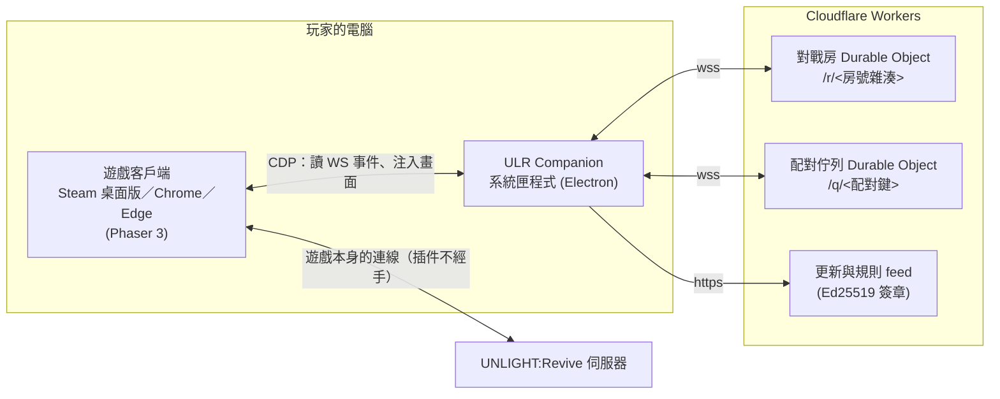

# ULR Companion

**繁體中文** ｜ [日本語](README.ja.md)

[](https://github.com/UnlightPlugin/ulr-companion/actions/workflows/ci.yml)
[](https://github.com/UnlightPlugin/ulr-companion/releases/latest)
[](LICENSE)

UNLIGHT:Revive 的玩家社群輔助工具 —— **自訂 COST 規則**、**遊戲內的快速比賽（自動配對）**
與**對戰輔助**。

常駐在 Windows 系統匣，透過 Chrome DevTools Protocol（CDP）連上正在執行的遊戲客戶端
（Steam 桌面版、Chrome 或 Edge），把功能直接畫進遊戲畫面裡。不修改遊戲檔案、不偽造封包
—— 送往遊戲伺服器的，一律是遊戲客戶端本來就會送的事件。

> 本專案是玩家社群製作的非官方工具，與遊戲的開發及營運方無關。

---

## 功能

### 自訂 COST 規則

- 角色・怪物・裝備・事件卡**四張表**都能改，壓 C 罰則可以寫成任意區間
- 托盤內建編輯器（編輯 COST／編輯規則／編輯描述）；從客戶端匯出的原版 COST 表可以直接 fork
- 遊戲裡的 COST 顯示與壓 C 罰則，照你選的那份規則重算
- 裝好就套用一份預設規則，並會自己更新（Ed25519 驗章通過才收）

### 迪特赫姆的「快速比賽」

- 迪城大廳多一顆「快速比賽」，與亞歷山卓城那顆同一張圖、同一種操作；INFO 區列出各檔的等待人數
- **COST 檔位照當下的牌組自己算**，不必填；落在官方檔位外的牌組就用它自己那一檔
- 配到人就自動開房／進房。同一套規則的**不同版本也配得到** —— 雙方交換「這一場」的計算指紋，一致才開打
- 對戰地點：亞城隨機、官方隨機，或指定一張地圖（含官方選單選不到的 `010`〜`013`）

### 對戰輔助（雙方都裝了才生效）

- **準備**：雙方都按了 OK 才真的送出，先按的人不再吃虧；按下後再按一次可以取消
- **秒數上限**：雙方各設一個移動階段的長度，取**比較長**的那個當共同值

### 牌組庫（已合入 main，尚未發布）

- 伺服器只存得了三副牌組；插件在本機存**無限副**，直接在遊戲的牌組編輯畫面上切換、新增、刪除
- 每一種房間（任務・渦・亞城・迪城）可以指定自己的牌組；按下開戰的那一下先把牌組套好才放行

### 其他

- **隱藏地圖**：官方開房選單選不到的 `010`〜`013` 放回選單
- **多開**：一個視窗管一個客戶端，桌面版、Chrome、Edge 可以同時各掛一個帳號
- **自動更新**：每小時檢查一次，下載完不會在對戰中套用

---

## 安裝（給玩家）

1. 到 [Releases](https://github.com/UnlightPlugin/ulr-companion/releases/latest) 下載 **zip**
   （不要下載 exe —— 瀏覽器常把未簽章的 exe 標成危險甚至直接擋掉）。

   > 解壓縮**之前**，在 zip 上按右鍵 →「內容」→ 勾「解除封鎖」→ 確定。
   > 解出來的檔案不帶 Mark-of-the-Web，執行時不會跳 SmartScreen。

   解壓到使用者目錄底下即可。**不要放在 `C:\Program Files\`**，那裡寫不進去，自動更新會失敗。

2. **在 Steam 設一次 debug port**，否則插件永遠接不上（畫面只會寫「等遊戲…」）。
   步驟寫在插件的 **設置 › 連線**，照著做一次就好。

3. 開遊戲，插件會自己接上。預設規則已經套好；要換成自己的規則或完全關掉，
   在 **牌組 › Cost 表**。關掉的話自動配對也用不了 —— 沒有規則就沒有「約定」可言。

幾件要先知道的事：

- **還沒有程式碼簽章**（憑證要錢，目前還沒買）。忘了解除封鎖的話，第一次執行點
  「其他資訊 → 仍要執行」。原始碼全部在這裡，自己 `npm run dist` 出來的是同一份東西，
  Release 頁也附了 SHA-256 可以核對。**不要照任何人的話關掉系統防護。**
- **自動配對會替你開房與進房**，也就是消耗 AP 並直接開打。它只會在你親手按下
  「快速比賽」之後才動，再按一次就是取消。
- 回報問題時請附上**版本號**（視窗左上角）與 **設置 › 記錄** 的內容 ——
  記錄裡不含任何遊戲內容，可以直接貼。

---

## 公平性與隱私

### 設計原則

- 不修改伺服器端的判定，不繞過官方戰鬥規則
- 會改變勝負的功能**一律雙方同意才生效**，協商永遠取「對雙方都不更嚴格」的那一邊 ——
  沒有任何設定能單方面縮短對手的思考時間
- 不顯示也不上傳對手未揭露的手牌或任何隱藏資訊
- 自訂 COST 是**自我約束**：只在雙方約定的對戰裡有意義，亞城與官方環境完全不受影響

| 功能     | 協商方式 | 沒配到對手時         |
| -------- | -------- | -------------------- |
| 準備     | and      | 退回「誤按反悔」窗口 |
| 秒數上限 | max      | 完全不縮短           |

### 會連到哪裡、送什麼

所有連線都到同一台伺服器（Cloudflare Workers，原始碼在 [`apps/link-worker`](apps/link-worker)）：

| 連線           | 何時                           | 送出去的東西                       |
| -------------- | ------------------------------ | ---------------------------------- |
| 中間人         | **對戰中才連**                 | 雜湊過的場次編號 + 四個偏好設定    |
| 配對佇列       | **按下大廳的「快速比賽」後**   | 雜湊過的配對條件（見下面的例外）   |
| 等待人數       | 待在迪城大廳時，最多 15 秒一次 | 雜湊過的配對鍵                     |
| 檢查更新／規則 | 每小時一次                     | 什麼都不送，只問「最新版是哪一版」 |

**不會送出去的東西**：你的名字、Steam 帳號或 token、對手是誰、任何一張手牌、對戰結果。

場次編號是遊戲那個 32 字元 room id 的 **SHA-256 前 64 bit**。伺服器只需要回答「這兩條
連線在不在同一場對戰」，而雜湊足以回答它 —— 所以「伺服器看得到什麼」是**數學問題，
不是信任問題**。沒進對戰時側通道完全不連線；連不上時自動退回單邊模式，功能會少，但不會壞。

**唯一的例外**：配到的對手用的是**另一個版本**的規則時，雙方要交換一份牌組描述子
（三個角色代號，例如 `["cc001_r03", "cc078_04", "cc205_02"]`）才能驗算這一場的結果是否一致。
它只拿去算指紋，不顯示、不記錄，也沒有任何介面問得到；規則版本相同時完全不會走到這一步。
完整的取捨見 [docs/match-making.md](docs/match-making.md) §7。

想自己架伺服器也可以：`apps/link-worker` 是完整的，把配置裡的「中間人」指過去就好。

---

## 架構



TypeScript monorepo（npm workspaces）。各 package 直接用 `@ulr/xxx` import 原始碼，clone 下來不用先 build。

| 路徑                                                 | 內容                                                                   |
| ---------------------------------------------------- | ---------------------------------------------------------------------- |
| [`packages/rule-schema`](packages/rule-schema)       | 規則格式、JSON Schema 驗證、RFC 8785 正規化、內容雜湊 ← 所有東西的依賴 |
| [`packages/cost-engine`](packages/cost-engine)       | COST 計算（四張表＋壓 C 罰則）、單場對局的語義指紋                     |
| [`packages/cdp-adapter`](packages/cdp-adapter)       | 連遊戲、解析 WS 事件、注入遊戲畫面（大廳、牌組編輯、開戰閘門…）        |
| [`packages/arbiter-link`](packages/arbiter-link)     | 中間人與配對佇列的協定（純函式）與客戶端                               |
| [`packages/arbiter-engine`](packages/arbiter-engine) | 仲裁與配對的狀態機、零件的生命週期（CLI 與托盤共用）                   |
| [`packages/deck-library`](packages/deck-library)     | 本地牌組庫（純資料層，不碰檔案也不碰 CDP）                             |
| [`packages/api-contract`](packages/api-contract)     | 規則登錄站 ULGG 的 API 型別契約                                        |
| [`apps/tray`](apps/tray)                             | 系統匣程式（Electron）                                                 |
| [`apps/companion`](apps/companion)                   | 命令列工具                                                             |
| [`apps/link-worker`](apps/link-worker)               | 伺服器：中間人、配對佇列、等待人數、更新與規則 feed                    |
| [`rules/`](rules)                                    | 從客戶端匯出的原版 COST 表與社群規則                                   |

公開的規則登錄、版本治理與戰果統計由 [ULGG](https://ulgg.online) 負責；這個 repo 是執行端。

---

## 技術重點

**規則的身分是它的內容雜湊。** 一份規則的識別不是名字也不是版本號，而是
`Schema 驗證 → Canonical JSON（RFC 8785）→ SHA-256`。「同樣叫 1.2.0 但內容被改過」
的兩份規則必須被判成不同，否則一致性檢查就是假的。規則登錄站是 PHP，所以另外提供了
語言無關的測試向量 —— `json_encode(21.0)` 在 PHP 給 `21.0`、JCS 要求 `21`，
這一個差異就會讓兩邊的雜湊全部對不起來（[docs/canonical-json.md](docs/canonical-json.md)）。

**但配對的閘門不是規則的雜湊。** 兩份規則只差在雙方都沒帶上場的角色時，這一場的結果完全
一樣，卻會讓兩人永遠配不到 —— 規則作者每發一次版就把社群切成兩半。所以同一套正規化被用了
兩次：一次蓋整份規則（版本識別），一次蓋**這一場**的計算結果（`evaluationHash`）。
雙方各自用自己的規則把兩副牌都算一次，四個指紋兩兩相等才開打（[docs/match-making.md](docs/match-making.md)）。

**失效時要安全。** 會碰遊戲的注入都有自己的退路，而且方向是「回到原本的樣子」：
準備功能靠心跳，插件當掉就撐完這個階段再關（不在玩家操作到一半時改變行為）；
開戰閘門有 8 秒看門狗，Node 沒回來就原樣放行 —— 用舊牌組開打，好過讓玩家卡死在畫面上。
開啟隨時生效、關閉只在階段邊界，因為關閉有傷害、開啟沒有（[docs/tray.md](docs/tray.md)）。

**注入的畫面長得像遊戲本身。** 大廳按鈕、牌組編輯的選單都用遊戲自己的貼圖、字型與
UI 外掛（rexUI）畫在 Phaser 場景裡。注入頁面裡的罰則算法與 Node 端的 Cost Engine 是
兩份實作，測試用窮舉比對確保兩者一致。repo 裡**沒有任何遊戲圖檔**；托盤視窗是純 CSS，
能維持 `default-src 'none'` 的 CSP。

**更新與規則都經過簽章。** 程式更新與預設規則的清單都用 Ed25519 簽在正規化後的位元組上，
驗章通過才收。zip 版可以自我更新（解壓到哪就更新到哪），下載完也不會在對戰中套用
（[docs/release.md](docs/release.md)）。

**問客戶端，不要猜。** 關於遊戲行為的結論 —— WS 事件的格式、原版 COST 怎麼算、對戰時間花在哪
—— 都是對著跑著的客戶端實測或讀客戶端本體得來的，文件裡記著出處與日期
（[docs/official-cost-rule.md](docs/official-cost-rule.md)、[docs/battle-timing.md](docs/battle-timing.md)）。

**測試。** 50 多個測試檔、1,300 個以上的測試；CI 刻意用**最低支援的 Node 版本**跑
format → lint → typecheck → test。

---

## 開發

需要 Node.js **20.19 以上**（npm workspaces）。系統匣程式只支援 Windows。

```bash
git clone https://github.com/UnlightPlugin/ulr-companion.git
cd ulr-companion
npm install
npm run verify      # format + lint + typecheck + test
```

| 指令                                        | 做什麼                                                                       |
| ------------------------------------------- | ---------------------------------------------------------------------------- |
| `npm run verify`                            | 提交前跑這個；全綠就代表環境沒問題                                           |
| `npm test` / `npm run test:watch`           | 只跑測試                                                                     |
| `npm run tray`                              | 建置並啟動開發版托盤（預設接 Chrome，見 [docs/tray.md](docs/tray.md)）       |
| `npm run dist`                              | 打包成可發布的 zip／安裝檔                                                   |
| `npx tsx apps/companion/src/index.ts <cmd>` | 命令列工具（`probe` `cost` `watch` `arbiter` `web` `pack`…，不帶參數看說明） |

試算一份規則：

```bash
npx tsx apps/companion/src/index.ts packages/rule-schema/test-vectors/rules/arcadia-balance-1.2.0.json
```

```ts
import { contentHash, validateCostRule } from "@ulr/rule-schema";

const result = validateCostRule(json);
if (result.valid) {
  console.log(contentHash(result.rule)); // sha256:bebd49f8…
}
```

### 文件

| 文件                                                | 內容                                              |
| --------------------------------------------------- | ------------------------------------------------- |
| [tray.md](docs/tray.md)                             | 托盤程式：畫面、多開、打包與大小                  |
| [arbiter-link.md](docs/arbiter-link.md)             | 中間人握手、準備與約定秒數、失效模式              |
| [match-making.md](docs/match-making.md)             | 自動配對、COST 檔位、跨版本相容、中間人看得到什麼 |
| [launching.md](docs/launching.md)                   | 怎麼把遊戲開起來、debug port、Chrome／Edge 分開   |
| [release.md](docs/release.md)                       | 打包、自動更新、程式碼簽章與 SmartScreen          |
| [official-cost-rule.md](docs/official-cost-rule.md) | 原版怎麼算 COST（出處是客戶端本體）               |
| [canonical-json.md](docs/canonical-json.md)         | 給其他語言實作同一套正規化                        |
| [cost-rule-v2-dsl.md](docs/cost-rule-v2-dsl.md)     | schemaVersion 2 草案：主 C／輔助、協同、容許曲線  |
| [battle-events.md](docs/battle-events.md)           | WS 事件目錄（雙邊實測）                           |
| [battle-features.md](docs/battle-features.md)       | 戰鬥功能的規劃與相依順序                          |
| [battle-timing.md](docs/battle-timing.md)           | 對戰時間花在哪 ——「能不能加速」的答案             |
| [battle-preplay.md](docs/battle-preplay.md)         | 預先出牌：攻防是循序的，中間人不需要              |
| [open-questions.md](docs/open-questions.md)         | 還沒定案的事                                      |

⚠ 規則檔一份只留一個 `.ulrcost.json`（`.rule.json` 是 `unpack` 的產物，不進版控 ——
兩個檔會被誤認成兩份規則）。

---

## 開發狀態

最新發布版是 **v1.1.0**（v1.0.0 是第一個正式版，之前的 0.x 是內測）。

| 工作包    | 內容                                            | 狀態                       |
| --------- | ----------------------------------------------- | -------------------------- |
| WP-01     | Schema／Canonical JSON／SHA-256／跨語言測試向量 | ✅                         |
| WP-02     | Cost Engine                                     | ✅                         |
| WP-07     | CDP 連線與遊戲內 UI                             | ✅                         |
| WP-08     | 打包、發布、自動更新                            | ✅                         |
| WP-09     | WS 事件層                                       | ✅                         |
| WP-12     | 移動階段仲裁（單邊）                            | ✅                         |
| WP-15     | 中間人握手＋約定秒數＋系統匣                    | ✅                         |
| WP-16     | 自動配對＋跨版本 COST 相容                      | ✅                         |
| WP-17     | 迪城快速比賽＋預設 COST 表＋zip 發布            | ✅                         |
| WP-18     | 對戰地點選得到地圖、檔位照牌組算、牌組庫        | ✅ main（尚未發布）        |
| WP-19     | 開戰前依房間套用牌組                            | ✅ main（尚未發布）        |
| WP-03〜06 | 規則登錄站 ULGG 端的 API 與統計                 | 🔲 ULGG 端（這邊只有型別） |

---

## 授權

MIT。見 [LICENSE](LICENSE)。
